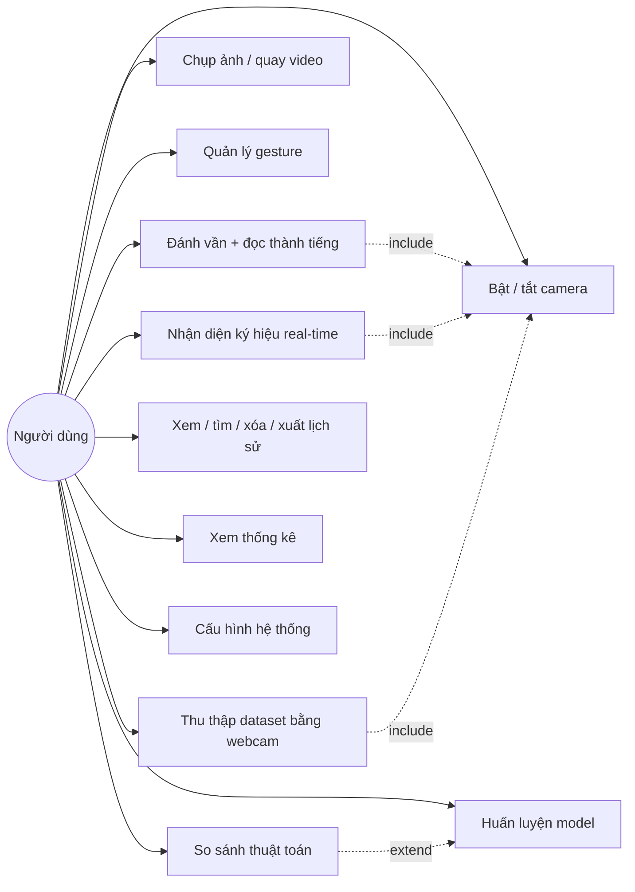
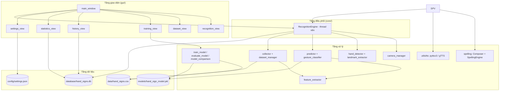
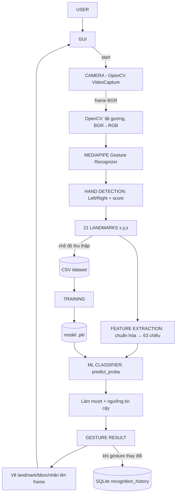
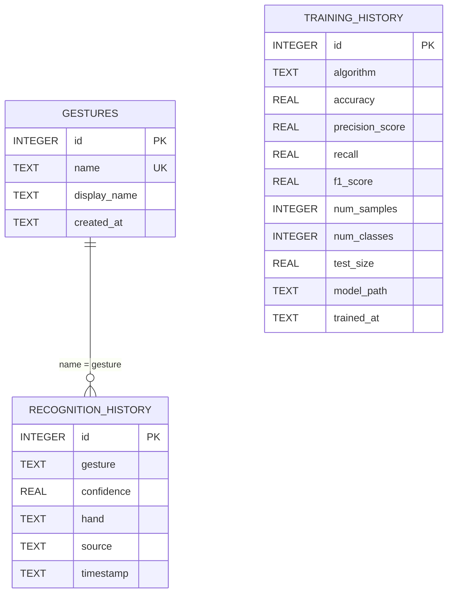
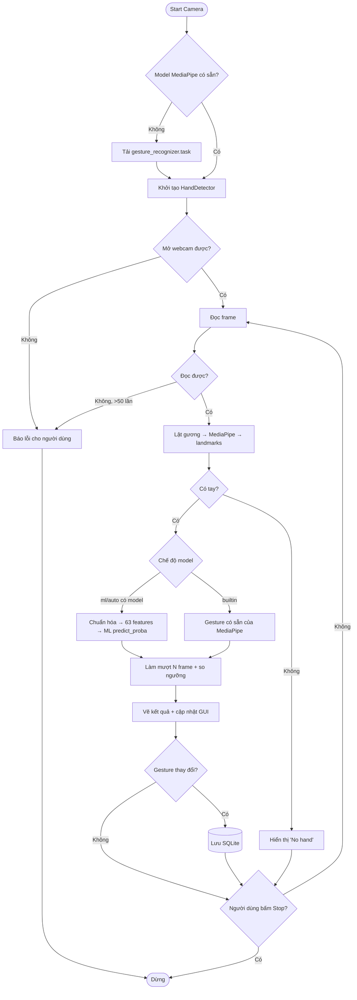
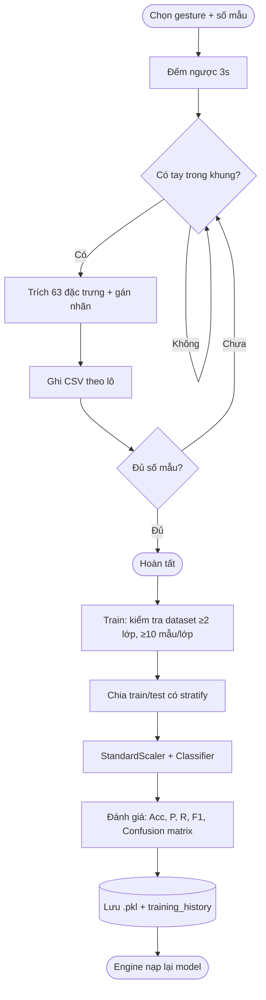
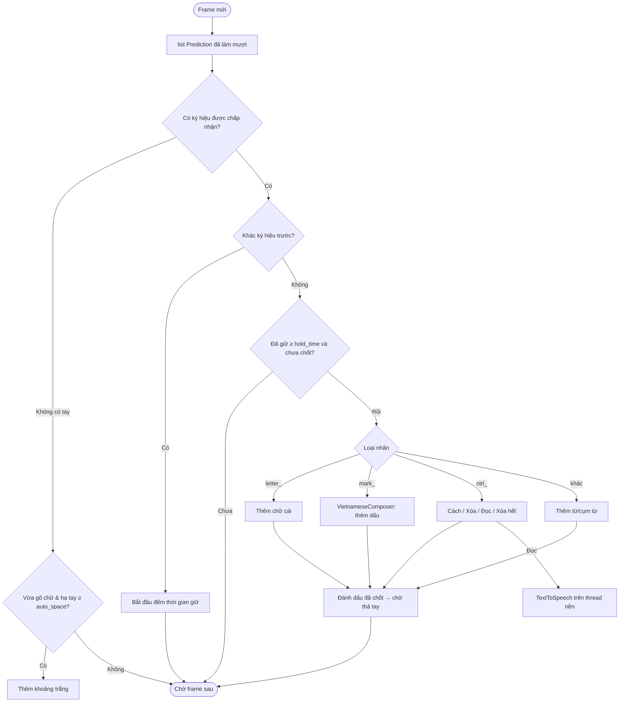

# 10 · Kiến trúc và thiết kế hệ thống

Tài liệu phân tích – thiết kế dùng cho báo cáo: phân tích bài toán, chức năng, Use Case, kiến trúc, luồng dữ liệu, ERD, class diagram, flowchart, cấu trúc thư mục, công nghệ. Các sơ đồ viết bằng Mermaid (xem trực tiếp trên GitHub/VS Code, hoặc dán vào https://mermaid.live).

---

## 1. Phân tích bài toán

**Đầu vào:** luồng video từ webcam (frame BGR, 640×480 … 1920×1080).
**Đầu ra:** tên ký hiệu bàn tay, độ tin cậy, tay trái/phải – cập nhật theo thời gian thực (~25–30 FPS).

Bài toán được chia thành 2 bài toán con:

| Bài toán con | Giải pháp | Lý do |
|---|---|---|
| Phát hiện bàn tay + định vị 21 điểm khớp | MediaPipe Gesture Recognizer (mô hình đã huấn luyện sẵn của Google) | Chính xác, nhanh trên CPU, không cần GPU |
| Phân loại ký hiệu từ 21 điểm | Machine Learning truyền thống (KNN / SVM / Random Forest / MLP) | Dữ liệu ít chiều (63 số), train vài giây, accuracy > 95% |

**Landmark là gì?** Là 21 điểm mốc giải phẫu trên bàn tay (cổ tay, các khớp và đầu ngón tay). Mỗi điểm có (x, y, z): x, y chuẩn hóa theo kích thước ảnh trong [0, 1], z là độ sâu tương đối so với cổ tay.

```
          8   12  16  20        0  : WRIST (cổ tay)
          |   |   |   |         1-4: ngón cái   (4 = đầu ngón)
          7   11  15  19        5-8: ngón trỏ   (8 = đầu ngón)
          |   |   |   |         9-12: ngón giữa
   4      6   10  14  18        13-16: ngón áp út
    \     |   |   |   |         17-20: ngón út
     3    5---9---13--17
      \    \          /
       2    \        /
        \    \      /
         1----0----
```

**Vì sao dùng landmark thay vì ảnh RGB trực tiếp?**
1. *Ít chiều:* 63 số thay vì 640×480×3 ≈ 921.600 số → model nhỏ, train nhanh, cần ít dữ liệu (vài trăm mẫu/gesture thay vì hàng chục nghìn ảnh).
2. *Bất biến với môi trường:* màu da, ánh sáng, phông nền, quần áo… đã bị MediaPipe "lọc bỏ", model chỉ học hình dạng bàn tay.
3. *Chạy real-time trên CPU:* không cần CNN/GPU.
4. *Dễ giải thích* trong báo cáo: mỗi đặc trưng có ý nghĩa hình học rõ ràng.

**Chuẩn hóa tọa độ** (`recognition/feature_extractor.py`):
1. Bù tỉ lệ khung hình: `x, z *= width/height`.
2. Tịnh tiến: `P_i = P_i − P_0` (cổ tay làm gốc) → không phụ thuộc vị trí tay trong khung hình.
3. Lật tay trái: `x = −x` nếu là tay trái → một model dùng cho cả hai tay.
4. Co giãn: chia cho `max ‖P_i‖` → không phụ thuộc kích thước tay / khoảng cách tới camera.

**Feature vector:** làm phẳng thành `[x0, y0, z0, x1, y1, z1, …, x20, y20, z20]` (63 chiều).

---

## 2. Chức năng của hệ thống

| Nhóm | Chức năng |
|---|---|
| Camera | Bật/tắt, chọn camera, quét camera, độ phân giải, FPS, lật gương, chụp ảnh, quay video |
| Hand Detection | Tối đa 2 tay, 21 landmark, đường nối, bounding box, Left/Right, confidence |
| Recognition | 7 gesture cơ bản có sẵn + gesture tự định nghĩa bằng ML, làm mượt, ngưỡng tin cậy |
| Spelling (Đánh vần) | Bảng chữ cái NNKH → ghép chữ thành câu tiếng Việt có dấu → đọc thành tiếng (TTS) |
| Environment | Kiểm tra phiên bản Python, thư viện, xung đột gói; bản vá tương thích |
| Dataset | Thêm/xóa gesture, thu thập tự động bằng webcam, xem dữ liệu, thống kê số mẫu |
| Training | 4 thuật toán, chọn tỉ lệ test, so sánh, confusion matrix, lưu model |
| History | Lưu SQLite, tìm kiếm, lọc ngày/tay, xóa, xuất CSV |
| Statistics | Tổng lượt, gesture phổ biến, độ tin cậy TB, accuracy, biểu đồ theo gesture/tay/ngày |
| Settings | Camera, ngưỡng, số tay, FPS, chế độ model, theme Dark/Light, ngôn ngữ EN/VI |

**Ba chế độ model** (`model_mode`):
- `builtin`: dùng 7 gesture có sẵn của MediaPipe (chạy được ngay, không cần train).
- `ml`: chỉ dùng model tự train (`models/hand_sign_model.pkl`).
- `auto` (mặc định): có model ML thì dùng ML, chưa có thì dùng builtin.

---

## 3. Use Case



| Use case | Tác nhân | Luồng chính |
|---|---|---|
| Nhận diện | Người dùng | Start → hệ thống mở camera → hiển thị gesture, confidence, hand, FPS → tự lưu lịch sử khi gesture thay đổi |
| Thu thập dữ liệu | Người dùng | Chọn gesture + số mẫu → Start Collecting → đếm ngược 3s → tự lấy mẫu → ghi CSV → báo hoàn tất |
| Huấn luyện | Người dùng | Chọn thuật toán + test size → Train → hiển thị metrics + confusion matrix → model mới được dùng ngay |
| Đánh vần | Người Điếc / người dùng | Làm ký hiệu chữ cái, giữ 1 giây → chữ được thêm vào câu → bấm dấu (nút/phím tắt) → hạ tay để cách từ → Đọc → máy phát âm câu tiếng Việt |

---

## 4. Kiến trúc hệ thống (phân tầng)



**Mô hình luồng (threading):**
- *Thread giao diện (Tkinter):* chỉ vẽ widget; mỗi 30 ms gọi `engine.get_latest()`.
- *Thread engine:* đọc camera → MediaPipe → dự đoán → vẽ → lưu lịch sử.
- *Thread huấn luyện:* train model, GUI kiểm tra kết quả bằng `after()`.
Dữ liệu chia sẻ được bảo vệ bằng `threading.Lock`; SQLite mở kết nối riêng cho mỗi thao tác.

---

## 5. Luồng dữ liệu



---

## 6. ERD / Database



Ghi chú: quan hệ GESTURES – RECOGNITION_HISTORY là quan hệ *logic* (không đặt khóa ngoại cứng) để lịch sử vẫn được giữ khi người dùng xóa một gesture. Dữ liệu mẫu (63 đặc trưng) lưu ở CSV vì đây là định dạng chuẩn cho ML và dễ mở bằng Excel/pandas.

---

## 7. Class diagram

```mermaid
classDiagram
    class Settings { +get() +set() +update() +save() +resolution }
    class CameraManager { +list_cameras() +open() +read() +release() +start_recording() +write() +stop_recording() }
    class FPSCounter { +update() }
    class HandInfo { +landmarks +handedness +handedness_score +builtin_gesture +pixel_points() +bounding_box() }
    class HandDetector { +load() +detect(frame) List~HandInfo~ +update_config() +close() }
    class LandmarkExtractor { +from_gesture_result() }
    class GestureClassifier { +load() +predict(features) +info() }
    class Predictor { +predict(hands) List~Prediction~ +configure() }
    class Prediction { +hand +gesture +confidence +source +accepted }
    class DatasetManager { +load() +append_samples() +counts() +summary() +add_gesture() +delete_gesture() +validate() }
    class DataCollector { +start() +cancel() +process(hands) +snapshot() }
    class RecognitionEngine { +start() +stop() +get_latest() +capture() +toggle_recording() +start_collection() +reload_model() +apply_settings() }
    class FrameResult { +frame +predictions +fps +primary() }
    class Database { +execute() +query() }
    class GestureRepository
    class HistoryRepository { +add() +search() +export_csv() +count_by_gesture() }
    class TrainingHistoryRepository { +add() +latest() }
    class VietnameseComposer { +apply_tone(word, tone) +apply_mark(word, mark) +tone_position(word) }
    class SpellingEngine { +update(predictions) +execute_label() +apply_tone() +apply_mark() +space() +backspace() +undo() +state() }
    class TextToSpeech { +speak(text, on_done) +speak_blocking(text) }
    class SpellingView
    class MainWindow { +show_page() -_tick() }
    class BasePage { +on_show() +on_frame() }

    RecognitionEngine --> CameraManager
    RecognitionEngine --> HandDetector
    RecognitionEngine --> Predictor
    RecognitionEngine --> DataCollector
    RecognitionEngine --> HistoryRepository
    RecognitionEngine ..> FrameResult
    HandDetector ..> LandmarkExtractor
    LandmarkExtractor ..> HandInfo
    Predictor --> GestureClassifier
    Predictor ..> Prediction
    DataCollector --> DatasetManager
    DatasetManager --> GestureRepository
    GestureRepository --> Database
    HistoryRepository --> Database
    TrainingHistoryRepository --> Database
    MainWindow --> RecognitionEngine
    MainWindow o-- BasePage
    CameraManager --> FPSCounter
    SpellingEngine ..> VietnameseComposer
    SpellingEngine ..> Prediction
    SpellingView --> SpellingEngine
    SpellingView --> TextToSpeech
    BasePage <|-- SpellingView
```



---

## 8. Flowchart

**8.1. Vòng lặp nhận diện real-time**



**8.2. Thu thập dữ liệu và huấn luyện**



**8.3. Chế độ đánh vần**



---

## 9. Cấu trúc thư mục

```
hand_sign_recognition/
├── main.py                     # Điểm khởi động: kiểm tra môi trường, khởi tạo service, mở GUI
├── check_environment.py        # Báo cáo môi trường READY / NOT READY
├── install.bat · run.bat · check_environment.bat   # Script cho Windows
├── requirements.txt            # Khoảng phiên bản đã kiểm thử
├── requirements-lock.txt       # Phiên bản chính xác đã kiểm thử (reproducible)
├── README.md                   # Giới thiệu + mục lục tài liệu
├── docs/                       # Tài liệu theo chủ đề (01 … 11)
├── config/config.py            # Đường dẫn + Settings (lưu config/settings.json)
├── core/engine.py              # Pipeline real-time trên thread nền
├── camera/camera_manager.py    # Webcam, FPS, ghi video
├── detection/
│   ├── hand_detector.py        # MediaPipe Gesture Recognizer (+ tự tải model)
│   └── landmark_extractor.py   # HandInfo, chuyển kết quả, vẽ landmark/bbox
├── recognition/
│   ├── feature_extractor.py    # Chuẩn hóa landmark → vector 63 chiều
│   ├── gesture_classifier.py   # Nạp model .pkl, predict_proba
│   ├── predictor.py            # Chọn nguồn ML/builtin, làm mượt, ngưỡng
│   └── spelling.py             # Ghép dấu tiếng Việt + bộ máy đánh vần
├── dataset/
│   ├── dataset_manager.py      # CSV: đọc, ghi, đếm, thêm/xóa gesture, kiểm tra
│   └── collector.py            # Thu thập mẫu tự động bằng webcam
├── training/
│   ├── train_model.py          # Train + lưu model
│   ├── evaluate_model.py       # Metrics, confusion matrix, biểu đồ
│   └── model_comparison.py     # So sánh 4 thuật toán
├── database/
│   ├── database.py             # Kết nối SQLite, tạo bảng, GestureRepository
│   ├── history.py              # Lịch sử nhận diện & huấn luyện, thống kê, xuất CSV
│   └── hand_signs.db           # (tự tạo khi chạy)
├── gui/
│   ├── main_window.py          # Cửa sổ chính + Dashboard
│   ├── common.py · camera_view.py
│   ├── recognition_view.py · spelling_view.py · dataset_view.py · training_view.py
│   └── history_view.py · statistics_view.py · settings_view.py
├── utils/
│   ├── python_compatibility.py # Bảng tương thích Python, bản vá tkinter/Tk 9
│   ├── dependency_checker.py   # Kiểm tra thư viện, phiên bản, xung đột
│   ├── tts.py                  # Đọc thành tiếng: pyttsx3 / gTTS
│   └── logger.py · helpers.py · constants.py
├── tests/test_spelling.py      # Kiểm thử tự động (50 ca)
├── models/                     # hand_sign_model.pkl, gesture_recognizer.task (tự tạo)
├── data/hand_signs.csv         # (tự tạo)
└── logs/ · captures/ · recordings/ · reports/
```
So với cấu trúc đề xuất ban đầu, project bổ sung:
- `core/engine.py` – lớp điều phối pipeline real-time chạy trên thread nền (tách khỏi GUI).
- `gui/common.py` – widget dùng chung; `gui/settings_view.py` – màn hình Settings.
- `recognition/spelling.py`, `utils/tts.py`, `gui/spelling_view.py` – chế độ Đánh vần (giai đoạn 2).
- `utils/python_compatibility.py`, `utils/dependency_checker.py`, `check_environment.py` – kiểm tra tương thích môi trường.
- `docs/` – tài liệu theo chủ đề; `tests/` – kiểm thử tự động.

## 10. Công nghệ sử dụng

| Công nghệ | Vai trò |
|---|---|
| Python 3.10–3.14 (64-bit) | Ngôn ngữ chính (đã kiểm thử, xem README mục 6) |
| OpenCV | Đọc webcam, xử lý ảnh, vẽ kết quả, ghi video |
| MediaPipe Tasks (Gesture Recognizer) | Phát hiện tay, 21 landmark, Left/Right, 7 gesture có sẵn |
| NumPy, Pandas | Xử lý vector đặc trưng, đọc/ghi CSV |
| Scikit-learn | KNN, SVM, Random Forest, MLP, metrics |
| Joblib | Lưu/nạp model |
| CustomTkinter + Pillow | Giao diện hiện đại Dark/Light |
| Matplotlib | Biểu đồ confusion matrix, so sánh, thống kê |
| SQLite | Lưu gesture, lịch sử nhận diện, lịch sử huấn luyện |
| pyttsx3 / gTTS | Đọc thành tiếng (offline / online) cho chế độ Đánh vần |


---
[← Mục lục](../README.md#tài-liệu)
